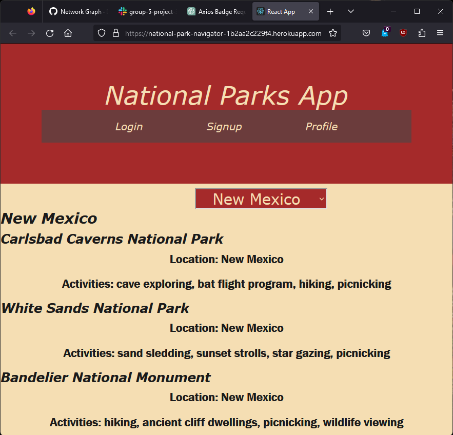

# National Park Navigator

The National Park Navigator is meant to be a progressive web app that periodically checks for internet connectivity, makes an API call to the National Park Service if it can, and populates a graphQL database with various information on various parks.

As of the current release, the progressive web functionality has yet to be implimented.

## Usage Instructions

### Heroku link

[national-park-navigator](https://national-park-navigator-1b2aa2c229f4.herokuapp.com/)

### To run from the terminal

* clone the repo
* add a `.env` file to `./src/utils`
* go to [the NPS website](https://www.nps.gov/subjects/developer/get-started.htm) and get a National Park Service API key
* add the line `npsApiKey=REPLACETHISWITHACTUALNPSKEY` to your `.env`
* run the command `npm i`
* run the command `npm start`
* if it doesn't work, you might need to run the command `npm i react-router-dom`
* if it still doesn't work, you might try `git stash` and then `git pull origin main`

## Credits

Malik Burrus, Andrew Gomoll, Dennis Inglehart, Joe Kraemer, Dylan Wednieski

## Screencap

A screencap of the search results in a normalized Firefox window:

